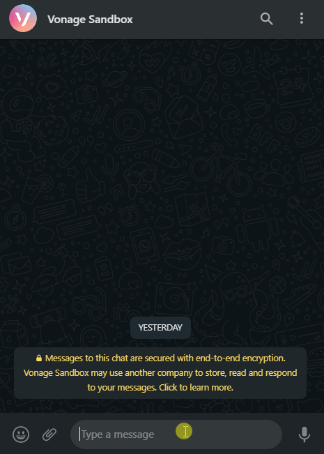
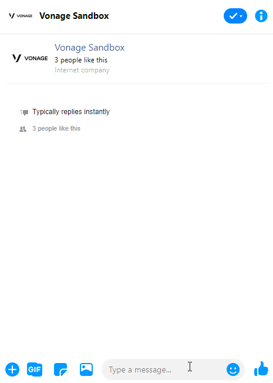

  
  

    
    
  

    

## Features

* Replies with the detailed Air Quality Information sourced from the weather stations under the [World Air Quality Project](https://aqicn.org/).
* Supports WhatsApp and Messenger channels by leveraging the Messages API provided by Vonage.

## Usage

### WhatsApp

### Messenger

## Getting Started

* Register at [`https://dashboard.nexmo.com/`](https://dashboard.nexmo.com/) and go to the Messages API Sandbox. 
* Whitelist a test recipient by following the instructions for the WhatsApp channel and/or the Messenger channel.
* Note down the API Key and the API Secret as well as the Sandox Numbers and/or the Sandbox IDs.
* Clone this repository and install the required dependencies.
* Run the Express Application using `yarn start` and expose it with `ngrok` by executing `ngrok http <application-port>`.
* Set the Inbound Webhook Endpoint on the Messages API Sandbox.

## License

The MIT License
